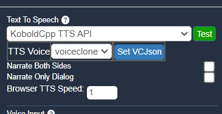
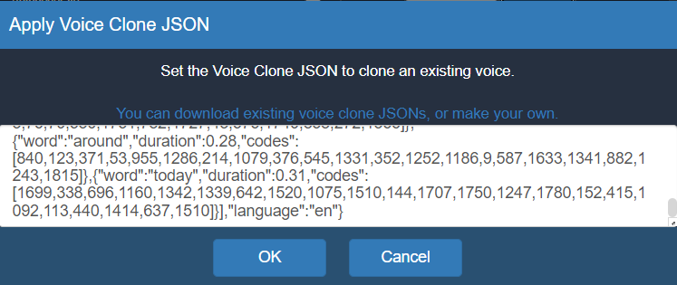

## KoboldCpp now supports OuteTTS Voice Cloning

However, it can be slightly challenging to set it up.
- The easiest way to get started is to use already pre-cloned voices, which you can find within the [speakers directory](speakers).
- Simply download the .json speaker file, open KoboldCpp with an OuteTTS model and WavTokenizer loaded.
- Paste the voice JSON into Kobold Lite UI's Settings > Media > TTS > voiceclone option.




- If you don't know how to get the OuteTTS and WavTokenizer models, [please read the wiki](https://github.com/LostRuins/koboldcpp/wiki#getting-an-ai-model-file).
- Once configured, you are good to go. Narrations will be done with that selected cloned speaker.

### Cloning your own speaker
You can also create your own cloned speaker voice.
To do that, you will need Python 3.10+ with the `outetts` package installed. You can install it with this commands:
```
pip install outetts==0.3.3 --no-deps
pip install scipy einops pyyaml huggingface-hub encodec matplotlib transformers pytorch-lightning tensorboardX soundfile numpy jsonargparse torchcrepe librosa inflect loguru polars natsort tqdm sounddevice mecab-python3 unidic-lite uroman openai-whisper pygame accelerate
```
Then after that, obtain a wav file containing a sample of the voice you want to clone.
Modify the [voice_cloning.py](voice_cloning.py) script with your input audio file, and let it generate the JSON.
Finally, use the JSON file in the same way as the above with the precloned voices.